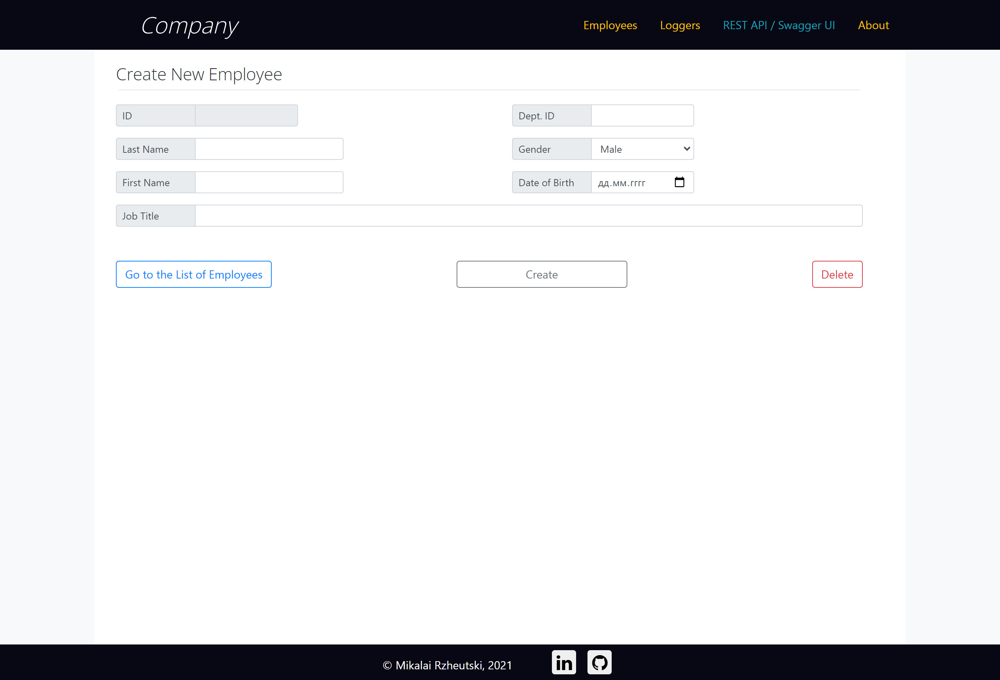

# Employees - Simple Web Application
> Тестовое задание (Николай Ржеуцкий)

## Содержание
* [О проекте](#о-проекте)
* [Как запустить](#как-запустить)
* [API](#api)
* [Скриншоты](#скриншоты)

## О проекте
* Spring Boot приложение с использованием Spring JDBC для доступа к БД
* Модульные и интеграционные тесты (JUnit)
* Пользовательский интерфейс (HTML5, Bootstrap, JS)

## Как запустить  
* **Вариант 1**  
Демонстрационная версия приложения запущена и работает на платформе Heroku. Доступ по  ссылке: https://employees-for-godel.herokuapp.com/employees 
  
* **Вариант 2**  
1. Прописать переменные среды конфигурации базы данных (SPRING_DATASOURCE_PASSWORD, SPRING_DATASOURCE_URL, SPRING_DATASOURCE_USERNAME) и номера порта (PORT).
2. Запустить на сервере команду ***mvn spring-boot:run*** (версия maven - 3.3.9)

## API
Документация по API, сформированная с помощью Swagger, доступна по адресу [https://employees-for-godel.herokuapp.com/swagger-ui/](https://employees-for-godel.herokuapp.com/swagger-ui/)

## Скриншоты
  
  
  

